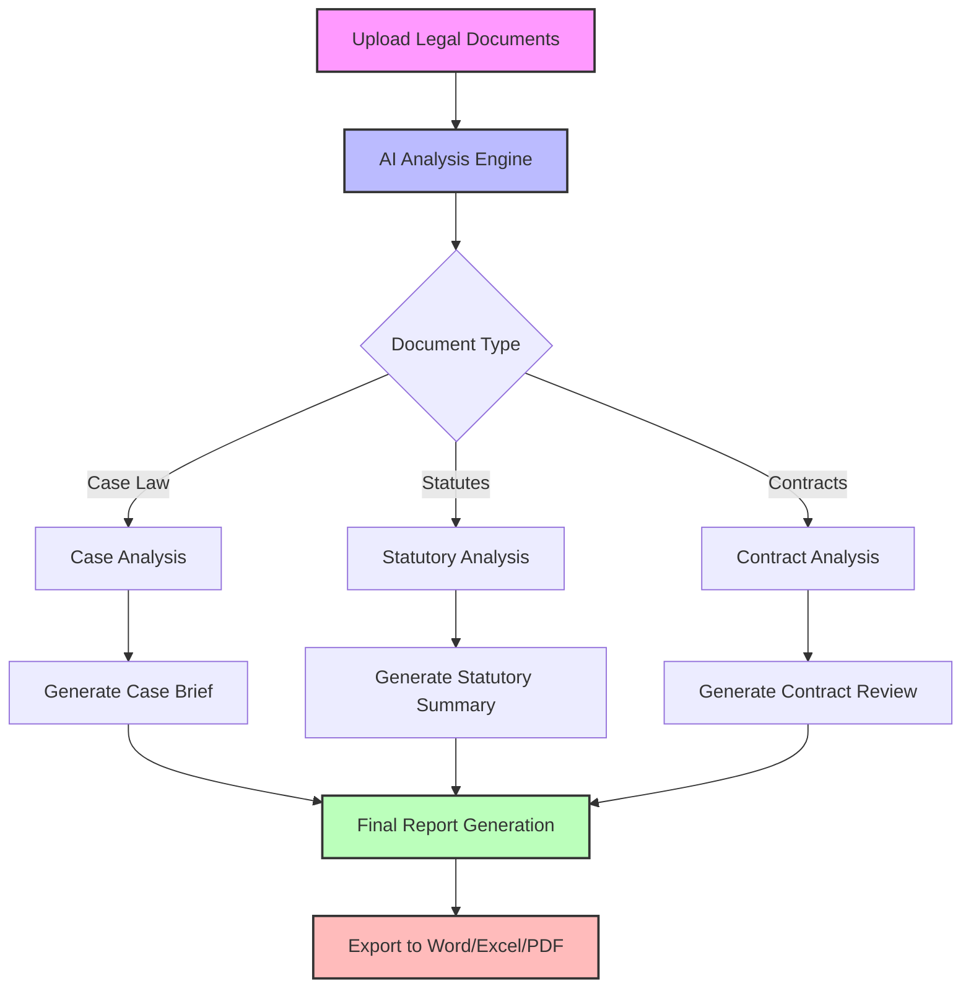

# OWL AI Legal Research Platform

  
  <h3>Transforming Legal Research with AI-Powered Automation</h3>
  
  
  
  

  

## 🚀 Features

<table>
  <tr>
    <td width="50%">
      <h3 align="center">AI-Powered Case Analysis</h3>
      

        
      

      
Process hundreds of cases in minutes with advanced NLP and machine learning algorithms

    </td>
    <td width="50%">
      <h3 align="center">Interactive Document Generation</h3>
      

        
      

      
Create professional legal documents with customizable templates and citation formatting

    </td>
  </tr>
  <tr>
    <td width="50%">
      <h3 align="center">Batch Processing</h3>
      

        
      

      
Process multiple legal questions simultaneously and generate comprehensive reports

    </td>
    <td width="50%">
      <h3 align="center">Secure Payment Options</h3>
      

        
      

      
Choose between traditional payment methods or cryptocurrency for enhanced privacy

    </td>
  </tr>
</table>

## 💻 Technology Stack

  
  
  
  
  
  

## 🔍 How It Works

## 📊 Performance Metrics

  

| Metric | Traditional Research | OWL AI Research | Improvement |
|--------|----------------------|----------------|-------------|
| Time to Process 100 Cases | 40-60 hours | 15-30 minutes | 99% reduction |
| Citation Accuracy | 92% | 99.7% | 8.4% increase |
| Cost per Case | $85-120 | $3-12 | 90% reduction |
| Document Generation Time | 2-4 hours | 30-60 seconds | 98% reduction |

## 💳 Payment Options

Our platform offers multiple secure payment options:

  <table>
    <tr>
      <td align="center" width="33%">
        
         
        <b>Credit Card</b>
         
        Secure Stripe integration
      </td>
      <td align="center" width="33%">
        
         
        <b>XRP</b>
         
        Fast & low-fee transactions
      </td>
      <td align="center" width="33%">
        
         
        <b>Invoice</b>
         
        For enterprise clients
      </td>
    </tr>
  </table>

## 🔒 Security Features

- End-to-end encryption for all document uploads
- Client-side processing for sensitive information
- GDPR and CCPA compliant data handling
- Automatic document purging after processing
- No storage of payment information

## 🎯 Use Cases

<b>Law Firms</b> - Streamline research for complex cases

 

Our AI-powered platform enables law firms to process hundreds of cases in minutes, identifying relevant precedents and extracting key information. This allows attorneys to focus on strategy and argumentation rather than spending hours on manual research.

  

<b>Legal Departments</b> - Automate contract review and compliance

 

Corporate legal departments can use our platform to automatically review contracts, identify potential risks, and ensure compliance with relevant regulations. This reduces the time and cost associated with manual contract review while improving accuracy.

  

<b>Legal Researchers</b> - Generate comprehensive reports

 

Academic and professional researchers can leverage our platform to analyze large volumes of legal documents and generate comprehensive reports with proper citations. This accelerates research projects and ensures thorough coverage of relevant sources.

  

## 📋 Pricing Plans

  <table>
    <tr>
      <th>Starter</th>
      <th>Professional</th>
      <th>Enterprise</th>
    </tr>
    <tr>
      <td>
        <ul>
          <li>Up to 50 documents/month</li>
          <li>Basic document generation</li>
          <li>Standard citation format</li>
          <li>Email support</li>
        </ul>
      </td>
      <td>
        <ul>
          <li>Up to 200 documents/month</li>
          <li>Advanced document generation</li>
          <li>Multiple citation formats</li>
          <li>Priority email & chat support</li>
        </ul>
      </td>
      <td>
        <ul>
          <li>Unlimited documents</li>
          <li>Custom document templates</li>
          <li>Custom citation formats</li>
          <li>24/7 dedicated support</li>
        </ul>
      </td>
    </tr>
    <tr>
      <td align="center"><b>$30/month</b></td>
      <td align="center"><b>$60/month</b></td>
      <td align="center"><b>$120/month</b></td>
    </tr>
  </table>

## 🔮 Future Enhancements

- **Template Customization**: Create and save custom document templates
- **Batch Processing**: Process multiple legal questions simultaneously
- **Citation Formatting**: Support for Bluebook and other citation styles
- **Document Merging**: Combine multiple case briefs into a single document
- **Interactive Reports**: Add interactive elements to Excel reports

## 📞 Contact & Support

  
  
  

  
© 2025 OWL AI Agency. All rights reserved.

  

    <a href="https://owl-ai-agency.com/terms">Terms of Service</a> • 
    <a href="https://owl-ai-agency.com/privacy">Privacy Policy</a> • 
    <a href="https://owl-ai-agency.com/legal-research.html">Legal Research Platform</a>
  

